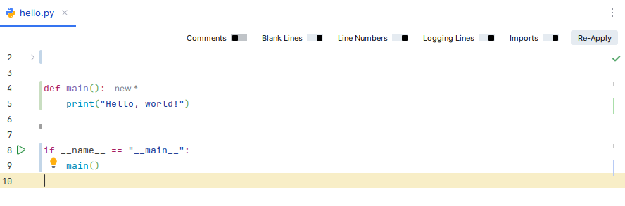

# CODE FOCUS - A PyCharm plugin

## Author

- Name:               Yves Vindevogel
- GitLab handle:      vindevoy
- E-mail:             yves.vindevogel@asynchrone.com

## Purpose

<!-- Plugin description -->
Code Focus hides the comments and logging lines from Python code (`.py` files) in PyCharm (Community or Professional), allowing developers to focus on the code itself without the clutter of those extra, and very useful, lines.
<!-- Plugin description end -->

## Compatibility

- **IDE**: PyCharm Community or Professional
- **Supported versions**: 2025.1 through 2026.1 (build range `251` — `261.*`)
- **Language scope**: Python (`.py`) only

## Installation

The plugin is not yet published on the JetBrains Marketplace, but a pre-built distributable zip is attached to every release.

1. Download the latest `code-focus-<version>.zip` from one of:
   - **GitHub Releases**: https://github.com/vindevoy/code-focus/releases/latest
   - **GitLab Releases**: https://gitlab.com/asynchrone/kotlin/code-focus/-/releases/permalink/latest
2. Open PyCharm (Community or Professional).
3. Go to `Settings` → `Plugins` → gear icon (top right of the dialog) → `Install Plugin from Disk…`.
4. Select the downloaded `code-focus-<version>.zip`.
5. Restart PyCharm when prompted.

After the restart, open any `.py` file — the **Code Focus** toggle bar appears above the editor, and **Settings → Tools → Code Focus** exposes the configurable substring list used by the *Show Logging Lines* toggle.

### Building from source

If you would rather build the zip yourself instead of downloading a release:

1. Run `./gradlew buildPlugin` — the distributable is produced in `build/distributions/code-focus-<version>.zip`.
2. Follow steps 2–5 above with the freshly built zip.

## Build & run

Standard Gradle commands from the JetBrains plugin template:

- `./gradlew build` — compile, run tests, and package
- `./gradlew runIde` — launch a sandboxed PyCharm instance with the plugin loaded
- `./gradlew test` — run all tests
- `./gradlew buildPlugin` — produce the distributable zip in `build/distributions/`
- `./gradlew verifyPlugin` — verify plugin structure and compatibility

Development uses **JDK 21** and **Kotlin 2.1.20**.

## Architecture

This plugin is written in Kotlin, as this is the preferred language for JetBrains plugins. The editor used for this, is IntelliJ Professional.

## AI

- Although completely written by Claude, all code was reviewed by a human.
- This project serves as an example of vibe coding with Claude CLI. All interaction is documented in each issue.
- This is a study project for me ([vindevoy](https://gitlab.com/vindevoy)) on how interaction with Claude CLI can work best.
- I have no experience in Kotlin, but 30 years of programming experience.

## Feedback

Issues and feature requests live on GitLab: https://gitlab.com/asynchrone/kotlin/code-focus/-/issues

## License

Released under the [MIT License](LICENSE).
